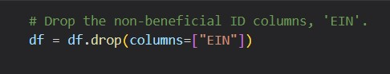
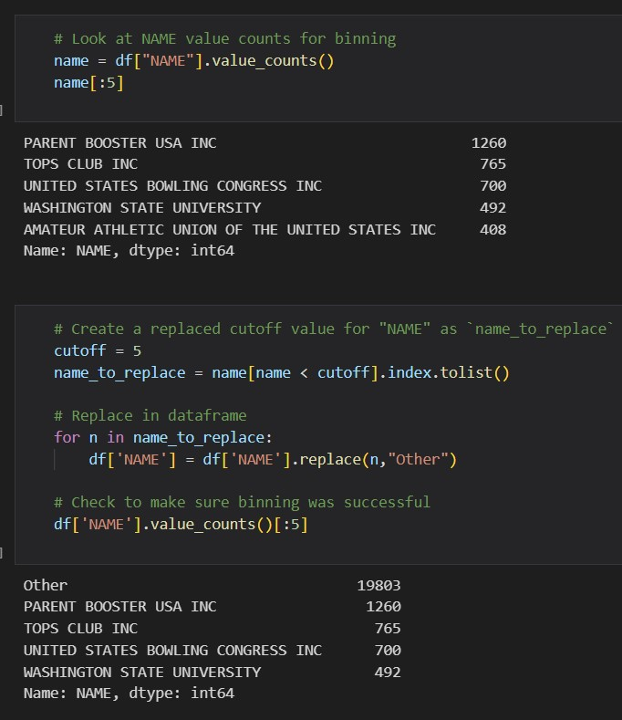
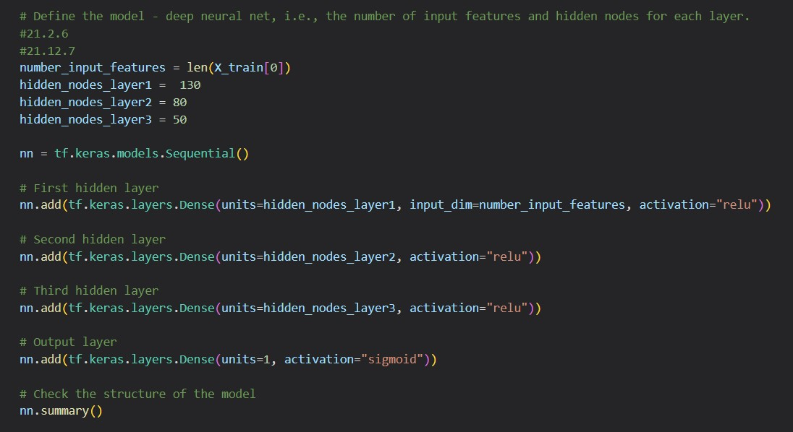
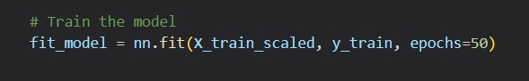
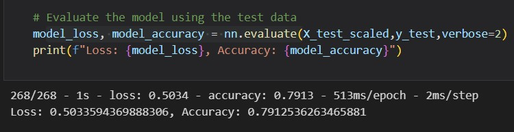

# Alphabet Soup Charity 

## Overview of the Analysis
The aim of this analysis is to develop a prediction model that can aid Alphabet Soup Charity in deciding which applicants to fund based on their success rate. Alphabet Soup has funded over 34,000 organizations in the past, and a prediction model can assist the organization in selecting the most suitable applicants for funding. 

## Results
* **Libraries and methods used to determine the models include:** 
    * Pandas
    * sklearn.preprocessing 
        * StandardScaler
    * sklearn.model_selection
        * train_test_split 
    * TensorFlow 

* **Data Preprocessing**
    * The data used for this analysis came from [charity_data.csv](AlphabetSoupCharity/Resources/charity_data.csv) read into a Pandas Dataframe. 

    * The columns `EIN` and `NAME` were dropped in Model 1, since they were considered non-beneficial. 
    
    * Labels (y): 
        * IS_SUCCESSFUL

    * Features (X):
        * APPLICATION_TYPE
        * AFFILIATION
        * CLASSIFICATION
        * USE_CASE
        * ORGANIZATION
        * STATUS
        * INCOME_AMT
        * SPECIAL_CONSIDERATION
        * ASK_AMT

    * Binning and cutoffs were implemented to increase the performance of the model by analyzing and simplifying the data. 

    * The data were transformed to numerics using `get_dummies` and transformed into training and testing sets using `train_test_split` and `StandardScaler`. 

* **Compiling, Training, and Evaluating the Model**
    * In **Model 1**: 
        * `len(X_train[0])` was used to determine the shape of the model. 
        * Two hidden layers were used containing `80` and `30` neurons. 
        * The activation function used for the hidden layers is `relu` and `sigmoid` for the output layer.  
        * Model 1 has an accuracy of `72%`, which is acceptable given that the objective is to predict the success of applicants. However, a higher accuracy of 90% or more would be preferable for a more successful model.  
        
    * In **Model 2 - Optimization**:  
        * To improve the accuracy, Model 2 was developed, which achieved an accuracy rate of `79%`. The modifications made to the model included:

            * Dropping only `EIN` column. 

            

            * Created binning to `NAME` with a cutoff equal 5. 

            

            * The use of three hidden layers with neurons of 
            `130`, `80`, and `50`. 

            

            * The epoch was decreased to `50`. 

            

            * Model 2 accuracy. 
            
            

## Summary
In summary, the results showed that Model 2 had a higher accuracy rate of 79%, which is a good model for the business case. This model can help Alphabet Soup to narrow down the applicants that should be funded based on their success rate, although a higher accuracy rate of 90% or more would provide even better results. To improve the accuracy, a different approach could be used, such as supervised learning and a combination of different types of algorithms, such as decision tree, random forest, and support vector machine (SVM), each tackling different areas of the data set. This approach could help to address the limitations of using a single model and improve the accuracy of the predictions. 
* **Decision Tree:** Uses a tree structure to represent a number of possibility paths and an outcome for each path. 
* **Random Forest:** Classify inputs based on multiple decision trees. 
* **Support Vector Machine (SVM):** Finding the best decision boundary that separates the classes in all possible features. 

#### References
IRS. Tax Exempt Organization Search Bulk Data Downloads. [https://www.irs.gov/](https://www.irs.gov/charities-non-profits/tax-exempt-organization-search-bulk-data-downloads)